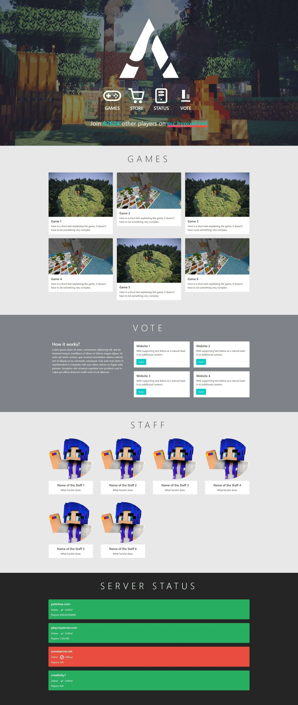

This is a template website that I have created to test Fiverr and a minecraft data API. Please note that the code quality might be subpar and could contain multiple bugs. Regrettably, I won't be offering any support for troubleshooting. Feel free to use it, but do so at your own risk.

I've removed all the images as I've placed this code in the MIT license.

Upon using this project, you may observe certain issues as some files are missing, leading to site breakage. I recommend adding your own files to resolve these issues.

## Screenshots:

## Disclaimer

Below is a list of all the external assets used in the development of those websites with their respective licenses.

- [Roboto](https://fonts.google.com/specimen/Roboto) ([Open Font License](https://scripts.sil.org/cms/scripts/page.php?site_id=nrsi&id=OFL))
- [Bootstrap](https://getbootstrap.com/) ([MIT](https://github.com/twbs/bootstrap/blob/main/LICENSE))
- [MCApi](https://mcapi.us/) ([?](https://github.com/Syfaro/mcapi-rs))
- [mc-player-counter](https://github.com/leonardosnt/mc-player-counter) ([MIT](https://github.com/twbs/bootstrap/blob/main/LICENSE))

## Contributors

- [@ArthurSegato](https://github.com/ArthurSegato)
